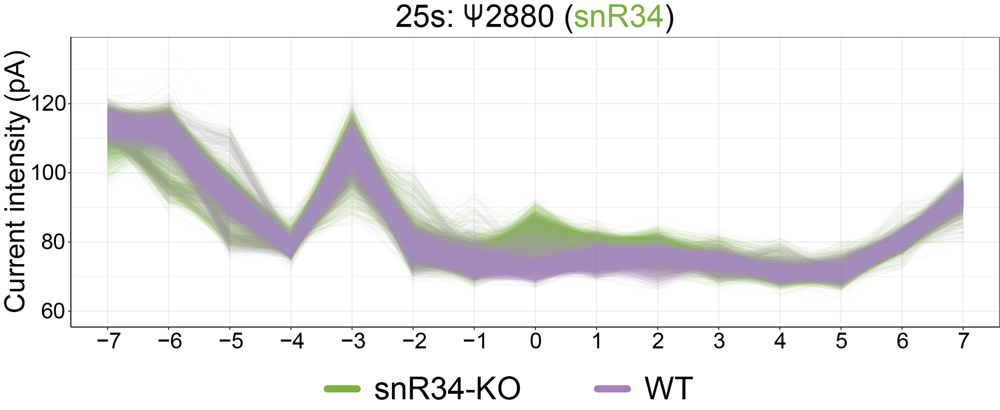

# NanoRMS: predicting NANOpore Rna Modification Stoichiometry
Prediction of RNA modification stoichiometry in direct RNA sequencing datasets from per-read current intensity information 


## General description
NanoRMS predicts modification stoichiometries by identifying reads that show distinct current intensity distributions in the query dataset, compared to those observed in a reference dataset.

NanoRMS is not a software to predict RNA modifications. It  uses the candidate sites predicted by third-party software (e.g. EpiNano) to estimate modification stoichiometries and their dynamics. 

NanoRMS uses as input: i) Nanopolish eventalign output files and ii) a list of predicted candidate RNA modification sites. It then performs the following steps:

* 1. Collapse Nanopolish eventalign output
* 2: Convert Nanopolish eventalign outputs into processed output for each 15-mer region 
* 3. Visualization of the per-read results (PCA, per-read current intensities) -- optional step, but highly recommended to see how your samples look like in terms of modified/unmodified reads
* 4. Stoichiometry prediction in PAIRED mode (2 samples), using either KMEANS or KNN.
* 5. Stoichiometry prediction in DE NOVO mode (1 sample), using ISOLATION FOREST *-- UNDER DEVELOPMENT--*

## Considerations when using nanoRMS 
* NanoRMS requires two different datasets to be executed (query-control)

* NanoRMS can be used to predict absolute stoichiometry of a given site, if it has been previously trained with unmodified and modified data, e.g. rRNA-modified sites coupled to knockout strains. The model can then be tested in independent datasets to obtain quantitative measurements. 

* Alternatively, NanoRMS can also be used to quantitatively estimate stoichiometry changes between two conditions (e.g. normal vs stress). In this scenario, it cannot predict the absolute stoichiometry of each individual site.

* NanoRMS should only be run on sites that have previously been identified as RNA-modified sites (e.g. RNA modifications can be predicted using [EpiNano](https://github.com/enovoa/EpiNano) or similar softwares). 

* NanoRMS  does **NOT** perform *de novo* predictions of RNA-modified sites. 

## Requirements/dependencies

* [Nanopolish](https://github.com/jts/nanopolish) (tested version: 0.12.4)
* [EpiNano](https://github.com/enovoa/EpiNano) (tested version 1.1)

## Before running the code:

### 1. Run Nanopolish on your FAST5: getting per-read current intensities
Before you start, you first need to run **[Nanopolish](https://github.com/jts/nanopolish) index** and **Nanopolish eventalign** on the raw FAST5 reads using the following command line: 

```bash
nanopolish index -d fast5_file fastq_file -s sequencing_summary_file
#Index file should be in the same path as the fastq file

nanopolish eventalign \
    --reads path/to/fastq_file \
    --bam  path/to/bam_file \
    --genome path/to/reference_file.fasta \
    --scale-events > output.txt
```

### 2. Run EpiNano 1.1 on your FASTQ: getting predicted RNA-modified sites
You need a list of predicted RNA-modified sites to select the 15-mer regions where you will run nanoRMS on. You can choose your regions of interest by running for example, **[EpiNano](https://github.com/enovoa/EpiNano)** on your paired datasets. We recommend to use "Summed_Errors" (difference in mismatch, deletion, insertion) rather than SVM-based predictions to obtain a list of candidate sites, which will be applicable to any given RNA modification as well as be more independent of the base-calling algorithm used. 

Obtain *EpiNano* base-calling error information from mapped BAM files:
```
<<<<<<< HEAD
samtools view -h bamfile.bam | java -jar sam2tsv.jar -r reference_file  > bamfile.bam.tsv 

python3.7 TSV_to_Variants_Freq.py3 -f bamfile.bam.tsv -t 10 
=======

samtools view -h test_data/test.bam | java -jar sam2tsv.jar -r test_data/yeast_rRNA_ref  > test.bam.tsv 

python3.7 TSV_to_Variants_Freq.py3 -f test.bam.tsv -t 10 

```


Then, convert *EpiNano* outputs into Summed_Errors, using the code below: 
```
Rscript summed_errors.R <epinano_file> <summed_errors_output_file>
```

Example using test data:

```
Rscript summed_errors.R test_data/wt_epinano.csv
```


## Running the code:

### 1. Pre-processing the Nanopolish Event-align output 
Generate a collapsed Nanopolish event align output, by collapsing all the multiple observations for a given position from a same read.

```
python3 per_read_mean.py <event_align_file>
```

Example using test data:

```
python3 per_read_mean.py test_data/data1_eventalign_output.txt
```


### 2. Create 15-mer windows of per-read current intensities centered in positions of interest
You need the output of Nanopolish Event-align 

```
Rscript --vanilla nanopolish_window.R positions_file <input_table> <label>
```


Example using test data:

```
Rscript --vanilla nanopolish_window.R test_data/positions test_data/data1_eventalign_output.txt_processed_perpos_mean.csv data1
```


### 3. Visualize current intensity information of modified sites (optional)

#### Distribution of current intensities at the modified site (position 0)

```
Rscript --vanilla density_nanopolish.R <window_file1> <window_file2> <window_file3(optional)> <window_file4(optional)>
```

Example using test data:

```
Rscript --vanilla nanopolish_density_plot.R test_data/sn34_window_file.tsv test_data/wt_window_file.tsv
```


#### Mean current intensity plots centered in the modified sites
```
Rscript --vanilla nanopolish_meanlineplot.R <window_file1> <window_file2> <window_file3(optional)> <window_file4(optional)>
```
Example using test data:

```
Rscript --vanilla nanopolish_meanlineplot.R test_data/sn34_window_file.tsv test_data/wt_window_file.tsv
```


#### Per-read current intensity plots centered in the modified sites
```
Rscript --vanilla nanopolish_perreadlineplot.R <window_file1> <window_file2> <window_file3(optional)> <window_file4(optional)>
```
Example using test data:

```
Rscript --vanilla nanopolish_perreadlineplot.R test_data/sn34_window_file.tsv test_data/wt_window_file.tsv
```





#### PCA plots from the per-read 15-mer current intensity data
```
Rscript --vanilla nanopolish_pca.R <window_file1.tsv> <window_file2.tsv> <window_file3.tsv(optional)> <window_file4.tsv(optional)>
```

Example using test data:

```
Rscript --vanilla nanopolish_pca.R test_data/sn34_window_file.tsv test_data/wt_window_file.tsv
```


### 4.Estimation of RNA modification via RNA read binning into 2 clusters -modified and unmodified- (*paired* mode)

#### a) Using KMEANS clustering

```
R --vanilla < read_clustering.R --args <file1.tsv> <file2.tsv> kmeans
```

Example using test data:
```
R --vanilla < read_clustering.R --args test_data/25s_2880.wt.15mer.perread.h.tsv test_data/25s_2880.sn34.15mer.perread.h.tsv kmeans
```


#### b) Using KMEANS on PCAed data
```
R --vanilla < read_clustering.R --args <file1.ts>v <file2.tsv> kmeans_pca
```
Example using test data:
```
R --vanilla < read_clustering.R --args test_data/25s_2880.wt.15mer.perread.h.tsv test_data/25s_2880.sn34.15mer.perread.h.tsv kmeans_pca
```

#### c) Using K-nearest neighbour (KNN) 
Important note: this option should be only used when 0% and 100% (or similar) modified datasets are available for training, e.g. rRNAs coupled with KO condition. 

```
R --vanilla < read_clustering.R --args <file1.tsv> <file2_UNM.tsv> <validation_set.tsv(optional)> knn
```

Example using test data:
```
R --vanilla < read_clustering.R --args test_data/25s_2880.wt.15mer.perread.h.tsv test_data/25s_2880.sn34.15mer.perread.h.tsv knn
```

Example using test data that includes predictions in independent validation data:

```
R --vanilla < read_clustering.R --args test_data/25s_2880.wt.15mer.perread.h.tsv test_data/25s_2880.sn34.15mer.perread.h.tsv test_data/25s_2880.sn3.15mer.perread.h.tsv test_data/25s_2880.sn36.15mer.perread.h.tsv  knn_validation
```

### 5. Estimation of RNA modification stoichiometry using Isolation Forest (*de novo* mode)

UNDER DEVELOPMENT


## Citation: 
#
Begik O*, Lucas MC*, Ramirez JM, Milenkovic I, Cruciani S, Vieira HGS, Medina R, Liu H, Sas-Chen A, Mattick JS, Schwartz S and Novoa EM. Decoding ribosomal RNA modification dynamics at single molecule resolution. bioRxiv 2020. doi: https://doi.org/10.1101/2020.07.06.189969

## Questions/doubts?
Please open an issue in the GitHub repo if you have any questions/doubts/suggestions about how to use this software. Thanks!
