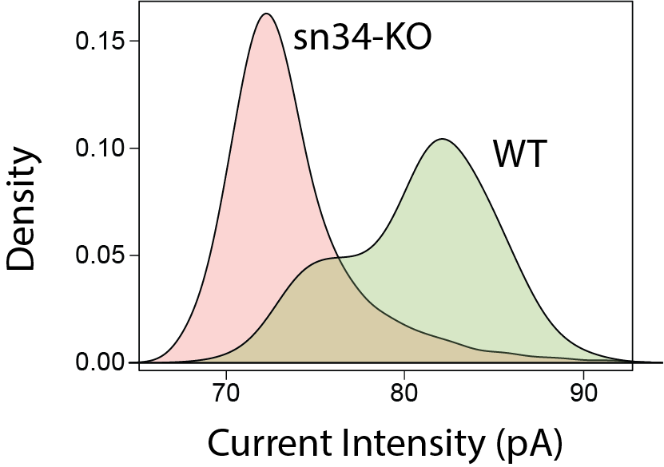

# NanoRMS: predicting NANOpore Rna Modification Stoichiometry
Prediction and visualization of RNA modification stoichiometry in direct RNA sequencing datasets from per-read information 


## Table of Contents  
- [General Description](#General-description)
- [Predicting RNA modification stoichiometry using Nanopolish resquiggling (not recommended)](#Predicting-RNA-modification-stoichiometry-using-nanopolish-resquiggling)
- [Predicting RNA modification stoichiometry using Tombo resquiggling (recommended)](#Predicting-RNA-modification-stoichiometry-using-tombo-resquiggling)
- [Visualization of per-read current intensities at individual sites](Visualization-of-per-read-current-intensities-at-individual-sites)
- [Citation](#Citation) 
- [Contact](#Contact) 
 

## General description
* NanoRMS predicts modification stoichiometries by classifying reads into modified/unmodified, based on their per-read features (current intensity, dwell time and/or trace).
* NanoRMS can be run in single mode (1sample) or paired mode (2 samples).
* NanoRMS can run both unsupervised (e.g. KMEANS, Aggregative Clustering, GMM) and supervised machine learning algorithms (e.g. KNN, Random Forest). The later will require pairwise samples where one of the conditions is a knockout.
* NanoRMS can predict stoichiometry from Nanopolish resquiggled reads or from Tombo resquiggled reads. The latter is the recommended option.


## Predicting RNA modification stoichiometry using Nanopolish resquiggling 
(not recommended)

This version is deprecated. If you still wish to use it, you can find the details and code [here](https://github.com/novoalab/nanoRMS/blob/master/README_nanoRMS_nanopolish.md) 


## Predicting RNA modification stoichiometry using Tombo resquiggling 
(recommended)

TO BE COMPLETED


## Visualization of per-read current intensities at individual sites

### 1. Data pre-processing

Firstly, generate a collapsed Nanopolish event align output, by collapsing all the multiple observations for a given position from a same read.

```
python3 per_read_mean.py <event_align_file>
```

Example using test data:

```
python3 per_read_mean.py test_data/data1_eventalign_output.txt
```
Secondly, create 15-mer windows of per-read current intensities centered in positions of interest

The output of Nanopolish event align generated in the previous step is used as input in this script.

```
Rscript --vanilla nanopolish_window.R positions_file <input_table> <label>
```

Example using test data:

```
Rscript --vanilla nanopolish_window.R test_data/positions test_data/data1_eventalign_output.txt_processed_perpos_mean.csv data1
```


### 2. Visualization of current intensity information in the form:

#### 2.1 Density plots

```
Rscript --vanilla density_nanopolish.R <window_file1> <window_file2> <window_file3(optional)> <window_file4(optional)>
```

Example using test data:

```
Rscript --vanilla nanopolish_density_plot.R test_data/sn34_window_file.tsv test_data/wt_window_file.tsv
```




#### 2.2. Mean current intensity plots centered in the modified sites
```
Rscript --vanilla nanopolish_meanlineplot.R <window_file1> <window_file2> <window_file3(optional)> <window_file4(optional)>
```
Example using test data:

```
Rscript --vanilla nanopolish_meanlineplot.R test_data/sn34_window_file.tsv test_data/wt_window_file.tsv
```


#### 2.3 Per-read current intensity plots centered in the modified sites
```
Rscript --vanilla nanopolish_perreadlineplot.R <window_file1> <window_file2> <window_file3(optional)> <window_file4(optional)>
```
Example using test data:

```
Rscript --vanilla nanopolish_perreadlineplot.R test_data/sn34_window_file.tsv test_data/wt_window_file.tsv
```


#### 2.4 PCA plots from the per-read 15-mer current intensity data
```
Rscript --vanilla nanopolish_pca.R <window_file1.tsv> <window_file2.tsv> <window_file3.tsv(optional)> <window_file4.tsv(optional)>
```

Example using test data:

```
Rscript --vanilla nanopolish_pca.R test_data/sn34_window_file.tsv test_data/wt_window_file.tsv
```


## Citation: 

Begik O*, Lucas MC*, Ramirez JM, Milenkovic I, Cruciani S, Vieira HGS, Medina R, Liu H, Sas-Chen A, Mattick JS, Schwartz S and Novoa EM. Decoding ribosomal RNA modification dynamics at single molecule resolution. bioRxiv 2020. doi: https://doi.org/10.1101/2020.07.06.189969

## Contact
Please open an issue in the GitHub repo if you have any questions/doubts/suggestions about how to use this software. Thanks!
